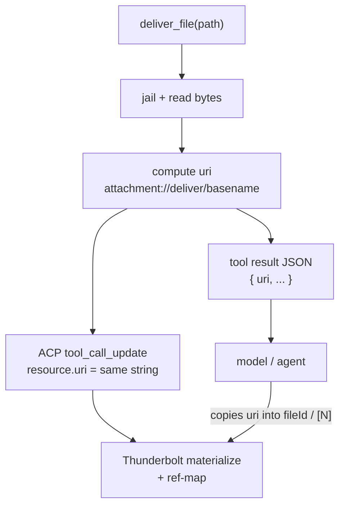

# Design: `deliver_file` возвращает `uri` (ZeroClaw)

**Date:** 2026-07-18  
**Status:** APPROVED — decisions frozen  
**Scope:** только model-facing результат `deliver_file` + связь с TB citations  
**Primary citations/widgets design:**  
`C:\dev\thunderbolt\.worktrees\ui-i18n\zeroclaw-integration\specs\2026-07-18-citations-widgets-acp-design.md`

### Shipping / branching (frozen)

| Item | Decision |
|------|----------|
| **This change ships in** | ACP embedded resource / `deliver_file` PR — branch `feat/acp-embedded-resource-blob` |
| **MCP blob intake** | **Separate PR** — `feat/mcp-embedded-resource-blob-intake`. Do **not** mix uri-in-result into the MCP PR, and do **not** open a third line (`feat/deliver-file-return-uri`). |
| **Base / target** | Branch from and open PR against upstream `master`. Fork `main` is integration only. |
| **Depends on / part of** | ACP P0 `deliver_file` outbound (already on this branch). TB citations/widgets resolve is a **follow-up in the TB fork**, after ZC exposes `uri`. |

---

## 1. Problem / context

ACP outbound already отдаёт клиенту стандартный блок:

```text
deliver_file → tool_call_update.content → resource { uri, mimeType, blob }
uri = attachment://deliver/<basename>
```

Модель видит краткий текст результата инструмента, но **не получает тот же `uri`**, который ушёл в ACP. Без этого агент не может честно процитировать файл в `[N]` / `<widget:document-result fileId=…>` — Thunderbolt на ZC-пути резолвит ссылки только через клиентский ref-map по этому `uri`.

---

## 2. Goals / non-goals

### Goals

1. В результате `deliver_file` (JSON для модели + summary) **обязательно** есть поле `uri`.
2. Строка `uri` **байт-в-байт** совпадает с `resource.uri` в ACP-уведомлении.
3. Один источник истины для генерации uri (не два независимых форматтера).
4. Документировать контракт для TB (см. primary spec).

### Non-goals

- Расширение ACP (`filename` на resource, обязательный `_meta`, новые ContentBlock).
- Изменение схемы inbound blob / MCP intake (отдельный PR; кроме того, что агент уже использует `[Document: name]`).
- Реализация TB ref-map / widget resolve (делается в Thunderbolt после этого среза).
- Auto-deliver без вызова `deliver_file`.

### Rejected: filename on ACP resource

**Отклонено.** Pretty-имя не едет по ACP wire. Имя берётся из маркера `[Document: …]` / MCP и кладётся агентом в `name=` виджета или текст markdown-ссылки. Подробности — в TB primary spec.

---

## 3. Architecture (ZC slice)



Source of truth for the uri string: **created here** in the `deliver_file` / ACP deliver path as a single computed value, then reused for both model result and ACP content. Do not regenerate with a second ad-hoc formatter that can drift.

---

## 4. Contract

### 4.1 ACP wire (без изменений формы)

```json
{
  "type": "resource",
  "resource": {
    "uri": "attachment://deliver/a1b2c3d4e5f6.pdf",
    "mimeType": "application/pdf",
    "blob": "<base64>"
  }
}
```

Поля `filename` на `resource` — **нет**. `_meta` — не требуется.

### 4.2 Model-facing tool result (изменение этого среза)

Минимум:

```json
{
  "uri": "attachment://deliver/a1b2c3d4e5f6.pdf"
}
```

Допустимо сохранить существующие поля (path, bytes, mimeType, ok, trailer `acp.deliver_file …`):

```json
{
  "ok": true,
  "uri": "attachment://deliver/a1b2c3d4e5f6.pdf",
  "path": "E:/workspace/uploads/a1b2c3d4e5f6.pdf",
  "mimeType": "application/pdf",
  "bytes": 12345
}
```

Summary (пример; точный текст — implementation detail):

```text
Delivered a1b2c3d4e5f6.pdf (12345 bytes)
uri=attachment://deliver/a1b2c3d4e5f6.pdf
acp.deliver_file path=... mimeType=application/pdf
```

Правила:

| Правило | |
|---------|--|
| `uri` обязателен при успехе | да |
| `uri` === ACP `resource.uri` | да, identical string |
| При ошибке jail/IO/size | как сейчас: ошибка инструмента, без resource / без success-uri |
| Base64 в rawOutput | нет (как P0) |

### 4.3 Как это кормит Thunderbolt

1. TB материализует outbound blob → `localFileId`.
2. TB строит ref-map: `uri → localFileId` (+ позиция в turn).
3. Агент копирует `uri` из результата в `fileId` виджета / опирается на `[N]`.
4. TB резолвит без Haystack fetch.

Полные resolve-правила, widgets, fork strategy: **TB primary spec** (ссылка в шапке).

### 4.4 Pretty name (не ZC wire)

Агент:

1. Берёт имя из `[Document: Договор.pdf]` (MCP / get_source_file / inbound marker).
2. Кладёт в `name="Договор.pdf"` или текст ссылки.
3. В `fileId` кладёт **только** `uri` из результата `deliver_file`.

---

## 5. Change surface (ожидаемые точки кода)

Без реализации в этом коммите; ориентир для плана:

- `deliver_file` tool implementation — добавить `uri` в structured/JSON result (+ summary при необходимости).
- ACP notification path для `ToolResult` / `deliver_file` — использовать **тот же** uri string при сборке `resource`.
- Тесты: equality model-uri vs ACP-uri; отсутствие `filename` на resource.
- Skill / prompt note для ACP-агента: копировать `uri`, не выдумывать prefix.

Документация book (`docs/book/src/channels/acp.md`) — по желанию в том же PR реализации, не в spec-only коммите.

---

## 6. Test plan (acceptance)

- [ ] Успешный `deliver_file` → JSON содержит `uri` вида `attachment://deliver/<basename>`.
- [ ] ACP notification для того же вызова: `resource.uri` == JSON `uri`.
- [ ] Ошибка инструмента → нет success-uri / нет resource blob (как сегодня).
- [ ] ACP resource **без** поля `filename`.
- [ ] Регрессия: blob не попадает в giant base64 `rawOutput`.

TB acceptance (widget/`[N]` → local-file) — в primary TB spec; блокируется этим ZC изменением.

---

## 7. Out of scope / follow-ups

- TB ref-map, widget resolve, skill inject на стороне Thunderbolt (TB fork).
- Удаление Haystack.
- P1 image / P2 audio ACP ContentBlocks.
- Protocol extension через `_meta` для pretty names.
- MCP `resource.blob` intake (separate PR on `feat/mcp-embedded-resource-blob-intake`).

---

## 8. Sequencing

1. **This PR (`feat/acp-embedded-resource-blob`):** uri в результате `deliver_file` + тесты + skill note (alongside existing ACP P0 outbound).  
2. **Separate PR:** MCP embedded resource blob intake (`feat/mcp-embedded-resource-blob-intake`) — do not merge scopes.  
3. **Then TB fork:** ref-map + resolve `[N]` / `document-result` (primary spec).

---

## 9. Decision log

| Topic | Decision |
|-------|----------|
| `uri` in tool result | Required, identical to ACP client `resource.uri` |
| ACP `filename` | **Rejected** |
| Required `_meta` | **Rejected** |
| Pretty name | Agent UI text from `[Document: …]` |
| Ships on | `feat/acp-embedded-resource-blob` (ACP / deliver_file PR → upstream `master`) |
| Not on | MCP intake PR; not a standalone `feat/deliver-file-return-uri` line |
| TB citations | Follow-up in TB fork after ZC exposes `uri` |
